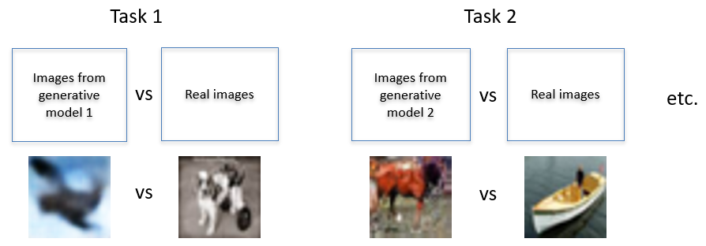

## The CLOFAI dataset

The dataset has been uploaded to HuggingFace and is available at this link: https://huggingface.co/datasets/willd98/CLOFAI 

It can be loaded using the following code:
```
from datasets import load_dataset  # pip install datasets
dataset_dict = load_dataset("willd98/CLOFAI")
```

It is split into five distinct image classification tasks, each of which contains 5000 real images and 5000 fake images. The train/test split is 80/20.
In each task, the real images are from CIFAR-10, while the fake images are from a generative model trained on CIFAR-10. The generative models used are:
- Task 1: Variational Autoencoder (VAE)
- Task 2: A model combining a VAE and an energy-based model
- Task 3: Generative Adversarial Network (GAN)
- Task 4: Flow-based model
- Task 5: Diffusion model (specifically, a DDIM)

A diagram of the dataset structure is below.



## Replicating our results

To get set up:
1. Clone the repo: ```git clone https://github.com/Will-Doherty/CLOFAI.git```
2. Install the required libraries: ```pip install -r requirements.txt```
3. Install the CLOFAI package using ```pip install -e .```

### Training

Our code for training is saved in the *training* directory. When running our code, the dataset will be accessed automatically via HuggingFace.

The continual learning methods available are:
- Benchmark: all tasks are trained on at once, providing a performance baseline for the classifier
- Naive: tasks are trained on sequentially without any attempt to mitigate catastrophic forgetting; indicates worst-case performance
- Experience Replay: data from previous tasks are interspersed with the training data for the current task
- GEM: data from previous tasks are used to constrain the optimization process, preventing the loss on previous tasks from increasing
- EWC: slows the updating of parameters that are important for performance on previous tasks

Upon running one of the training files using e.g. ```python train_benchmark_classifier.py```, it will error and prompt you for arguments. Follow the instructions in the error message. As an example, training the classifier using the naive method might end up looking like 
```python train_benchmark_classifier.py --weights_and_results_path "path/to/save/results"```

### Inference

To run the model at inference, run test_model.py from the *model* directory. This might look like 
```python CLOFAI/model/test_model.py --results_path "path/to/save/results" --weights_file weights/naive_weights.pth```

## Citing CLOFAI

Please use the following BibTeX entry:
```bibtex
@misc{doherty2025clofaidatasetrealfake,
  title={CLOFAI: A Dataset of Real And Fake Image Classification Tasks for Continual Learning}, 
  author={William Doherty and Anton Lee and Heitor Murilo Gomes},
  year={2025},
  eprint={2501.11140},
  archivePrefix={arXiv},
  primaryClass={cs.CV},
  url={https://arxiv.org/abs/2501.11140}
}
